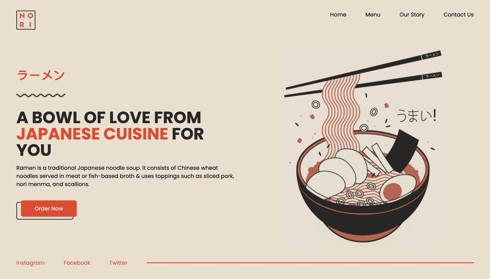
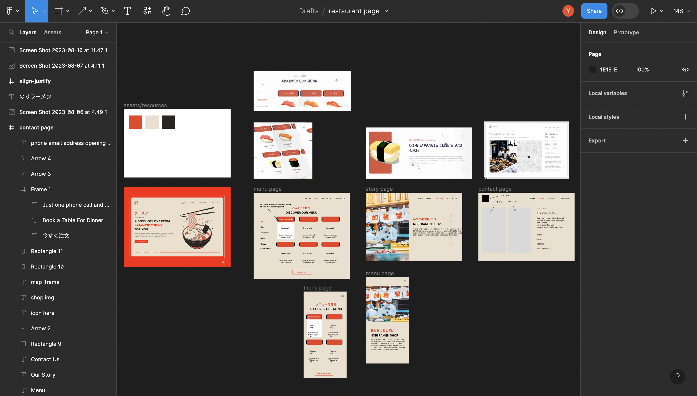

# Restaurant page 

[Live Demo](https://yusei07.github.io/restaurant-page/)

Learned to apply webpack and integreate it with tailwind. Mainly, the purpose of this project is to implement the ES6 Module pattern, which allows a better code reuse.

## UI/UX Design

- Creds to designs on behance for the inspiration.

## Creds
- [Unplash](https://unsplash.com/) - assets/img
- [Pinterest](https://pinterest.com/) - assets/img
- [Padmini Barik](https://dribbble.com/shots/15132015-Japanese-Restaurant-Hero-Section-Concept#) - hero section
- [Rizki](https://dribbble.com/shots/19129666-Oish-Japanese-food-restaurant-landing-page) - other section 
